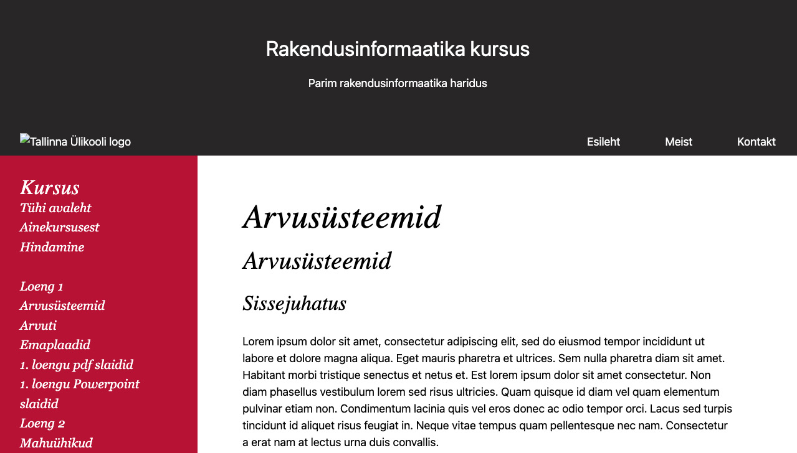

# RIF20 Valikpraktika-1 kood – online kursuse rakendus

TLU HK RIF20 Valikpraktika raames koostatud rakendus  


## Töö sisu

Tegemist on rakenduse I faasiga. Ülesandeks oli eeltööga selgitada välja kursuse haldajate ning lõppkasutajate vajadused ning luua neile sobilik õppekeskkond. Kaardistada kasutajateekonnad, luua prototüüp ja esialgne rakendus.

Eesmärgiks oli luua rakendus, mis on täielikult haldajate kontrolli all, mille sisu on võimalik ristkasutada ning kasutajasõbralikul moel kätte saada, kuvada ja töödelda.  
Rakenduse sisuhaldus asub Githubis. Githubi api kaudu saab sisu jagada ja kuvada.  
Esimeses faasis luuakse sisu git'i käskluste baasil. Eraldi kasutajaliidest pole.

Lõppkasutajale on loodud kaasaegne kasutajaliides, mis on kasutatav nii mobiilis kui desktopis.  
Kasutatud on Handlebar tepmliitimiskeelt ning Tailwind CSS-raamistikku.
Sisumootoriks on Node + Express.js

## Rakenduse kasutamine ja käivitamine

### Installeerimine

Kopeeri projekt oma masinasse:

```bash
git clone https://github.com/tluhk/rif20-valikpraktika-1
cd rif20-valikpraktika-1
npm install
```

### Käivitamine

Githubiga ühenduse loomiseks on tarviline Githubi tokeni loomine ja selle lisamine juurkataloogi .env faili.
faili sisuks `AUTH = 'Bearer ghp_SINUGITHUBITOKEN'`

Seejärel võib rakenduse käivitada:

```bash
npm start
```

Seejärel sisesta brauseri aadressiribale `localhost:3000` ning võid kursusega pihta hakata.

## Valikpraktika I grupp

Tiina, Kristi, Krister, Juho, Kalev

Valikpraktika repo: https://github.com/tluhk/rif20-valikpraktika
