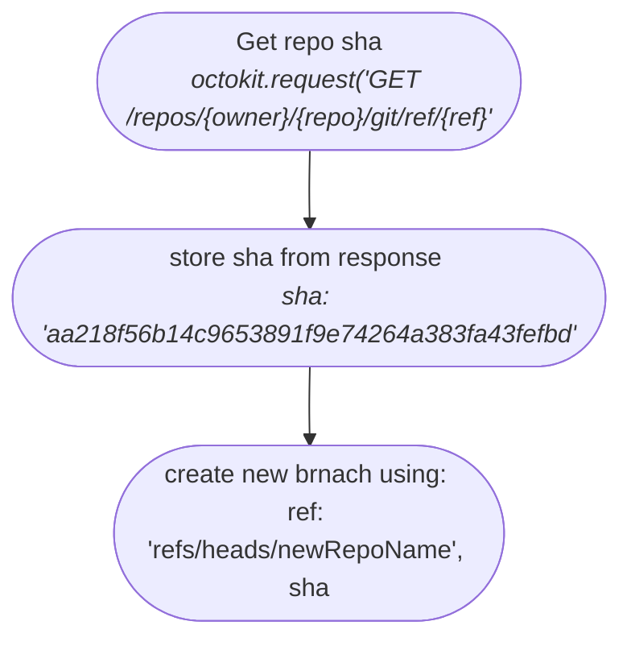

**Uue haru lisamine ainekursusele**

- Kasutaja peab olema sisse loginud ja tal peab olema 'teacher' õigused,
---
Sisendiks on kasutjalt vaja küsida:
- kursust, millele on uut haru vaja
- uue haru nime
- millisest harust tehakse koopia (vaikimisi ``main``)

``{owner}`` - tuleb .env failist (tluhk)

``{repo}`` - kursuse nimi millele uus haru lisada (koos "HK_" prefiksiga )

``{ref}`` - haru, millest tehakse koopia (main)

