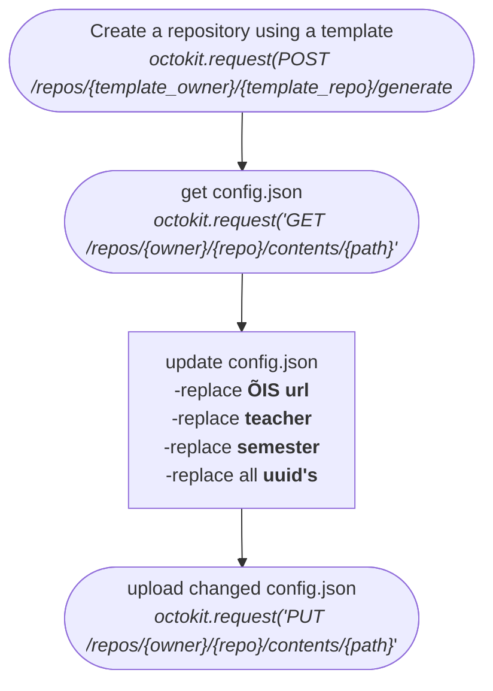

**Uue ainekursuse lisamine**

- Kasutaja peab olema sisse loginud ja tal peab olema 'teacher' õigused,
- template repo nimi peab olema teada (.env failist?)
---
Sisendiks on kasutjalt vaja küsida:
- kursuse nime (sellele lisatakse automaatselt prefix - näit. 'HK_')
- kursuse ainekaardi linki õis'is
- semestrit

