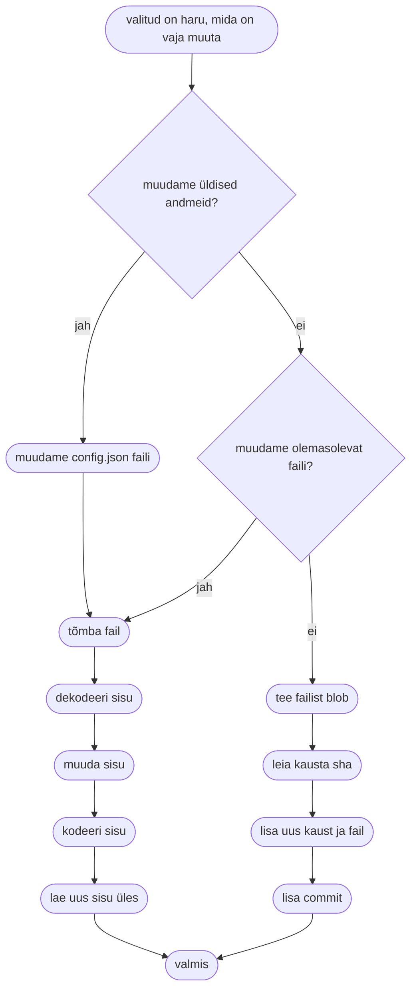

**Ainekursuse haru muutmine**
 
- Kasutaja peab olema sisse loginud ja tal peab olema 'teacher' õigused. 
---

```mermaid
flowchart TD
start(["valitud on haru, mida on vaja muuta"])-->
general{muudame üldised andmeid?}
general-->|jah| json([muudame config.json faili])-->editold
general-->|ei| oldf{muudame olemasolevat faili?}
oldf-->|jah| editold([tõmba fail])-->decode([dekodeeri sisu])-->cont([muuda sisu])-->enc([kodeeri sisu])-->upl1([lae uus sisu üles])-->alldone
oldf-->|ei| blob([tee failist blob])-->gtree([leia kausta sha])-->addtree([lisa uus kaust ja fail])-->commit([lisa commit])-->
alldone([valmis])        

```

