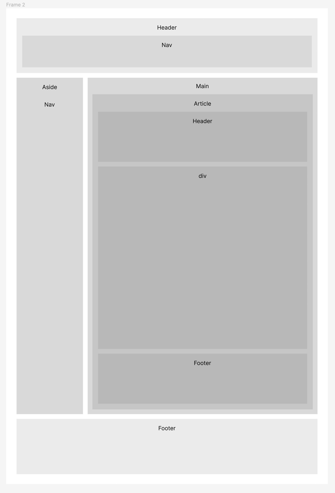

# Frontendis kasutatud tehnikad ja põhimõtted

[<Tagasi](../../README.md)  
HTML on üles ehitatud lähtuvalt semantilise HTML põhimõtetest ja kõigile ligipääsetavuse huvidest.

Esialgse HTML-i skeem:



Stiilimiseks on kasutusel Tailwind CSS-raamistik. Kaalumisel olid ka Windi CSS, UnoCSS ja Spectra, kuid nende juhendid olid puudulikumad kui Tailwindil, mistap sai nendest loobutud. Samuti oli kaalumisel üldse raamistikust loobumine ja selle asemel puhta CSS-i ja CSS-grid'i kasutamine, kuid tagasisidest selgus, et backendi arendajatele, kes peavad vahest samuti frontendi osas käe külge panema, on raamistiku kasutamine lihtsam.

Tailwind kontrollib allikafailidest, milliseid klasse kasutatakse ning kopeerib need siis lõppfolderisse.

## Tailwindi kasutus

Tailwind tuleb kasutamiseks installeerida. Testida saab aga ka kasutades Tailwindi CDN-i repositooriumeid.  
Siinses rakenduses on kasutatud Tailwindi koos PostCSS pistikprogramm. PostCSS võimaldab kasutada lisasid nagu koodi miniseerimine, tootjate eesliidete lisamine, koodi kontrollimine(linting).

Installeerimise juhendid leiab (siit:)[https://tailwindcss.com/docs/installation/using-postcss].
Installeerimise järel tekivad juurkataloogi samad failid, mis eelneval lingil oleval lehel ning puuduvad tuleb lisada nii nagu näidatud.

### Isikupärastamine

Peamised seadistused tehakse `tailwindconfig.js`-is.
Tailwindi `Contendi`real tuleb ära näidata, millistes failides ja folderites asub stiilitav kood.  
Siinse näite puhul: `content: ['./views/**/*.{handlebars,html,js}', './views/home.handlebars'],`
Kui muuta midagi nendes failides ja seejärel käivitada Tailwindi kokkukirjutamiskäsklus, lisatakse sobiv osa css koodi stiilifaili.
Kompileerimiskäsklus ja sihtpunktid on mõitlik lisada `package.json` faili: `"build-css": "tailwindcss -i ./src/main.css -o ./public/css/main.css"`

Vaikimisi on Tailwind nagu 0-stiil, tema eripäraks ongi see, et sa ehitad üles oma kujunduse, nö sisustades ära Tailwindi poolt antud raamid.

## Siin rakenduses ettevõetud asjad.

- Layout  
  Layout'i loomiseks on kasutatud Tailwindi Flex'i klasse
- Tüpograafia
  Lisatud on oma kirjatüüp ja hierarhia. Fondid on asendatud `tailwindconfig.js`-is.`defaultTheme` on defineeritud sama faili alguses.

  ```javascript
  const defaultTheme = require('tailwindcss/defaultTheme');

  extend: {
      fontFamily: {
        sans: ['Montserrat', ...defaultTheme.fontFamily.sans],
        serif: ['Zilla Slab', ...defaultTheme.fontFamily.serif],
      },
  ```

  Pealkirjad ja baasfondi suurus on defineeritud sama faili pistikprogrammis:

  ```javascript
  plugins: [
    plugin(({ addBase, theme }) => {
      addBase({
        html: { fontSize: '18px' },
        h1: {
          fontSize: theme('fontSize.xxxlsmall'),
          fontWeight: '700',
          lineHeight: '1.2',
          marginTop: '1.25rem',
          marginBottom: '1.25rem',
        },
  ...
  ```

  Seda on võimalik teha ka css-is.

- Värvilahendus
  Värvid on defineeritud `tailwind.config.js`-is, kuid kasutatud ka Tailwindi enda värve:

```javascript
export {
  content: ['./views/**/*.{handlebars,html,js}', './views/home.handlebars'],
  theme: {
    colors: {
      brand_red: '#b71234',
      brand_black: '#282627',
      brand_grey: '#545153',
      primary: colors.red,
      secondary: colors.stone,
      white: colors.white,
      success: '#A4D65E',
    ...
```

Neid on võimalik seega kasitada nt `bg-primary-700`või `text-secondary-500`jne

## Siinse lehe spetsiifika, komponendid ja kujundusosade loomine.

### Komponendid

Komponendid võib luua nii `tailwind.config.js`-is kui ka `main.css`-is. Esimesel juhul `addComponent`pistiku abil nt nii:

```javascript
const plugin = require('tailwindcss/plugin');

export {
  plugins: [
    plugin(function ({ addComponents }) {
      addComponents({
        '.btn': {
          padding: '.5rem 1rem',
          borderRadius: '.25rem',
          fontWeight: '600',
        },
        '.btn-blue': {
          backgroundColor: '#3490dc',
          color: '#fff',
          '&:hover': {
            backgroundColor: '#2779bd',
          },
        },
        '.btn-red': {
          backgroundColor: '#e3342f',
          color: '#fff',
          '&:hover': {
            backgroundColor: '#cc1f1a',
          },
        },
      });
    }),
  ],
};
```

Kuid need võib ehitada ka `css`failis nt nii:

```javascript
@layer components {
  .btn {
    @apply py-4 px-4 rounded-sm shadow-2xl;
  }
  .btn-primary {
    @apply bg-primary-700 text-white hover:bg-primary-800;
  }
  .btn-menu {
    @apply w-28;
  }
}
```

### Sticky sidebar

Külgriba jääb lihtsama navigatsiooni huvides kui veebilehte ekraani ülaserva kerid, ülaserva pidama. Nn "sticky position".  
Selleks tuleb kasutada CSS omadust – sticky. Et see toimiks, on vaja määrata selle külgriba kõrgus ning CSS omadusele top, anda väärtus 0 (sel juhul kinnitub ta 0-i jõudes).

[<Tagasi](../../README.md)
