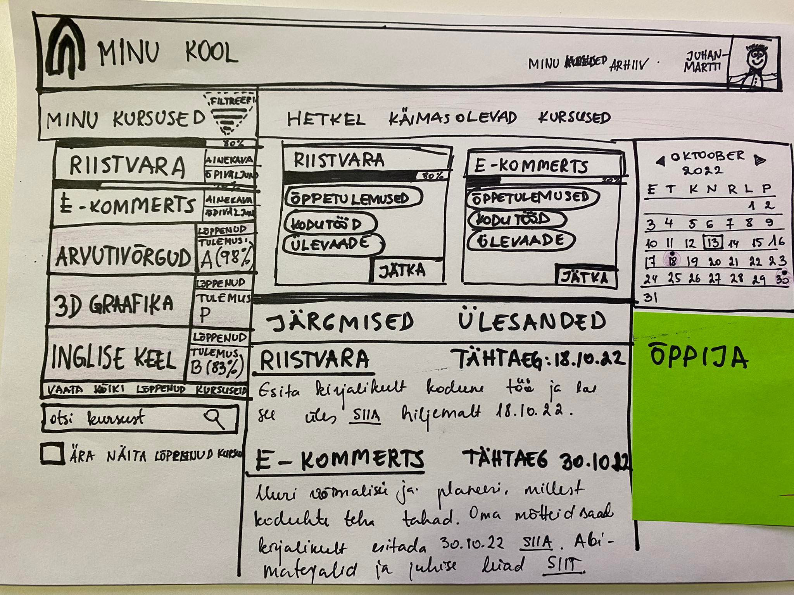
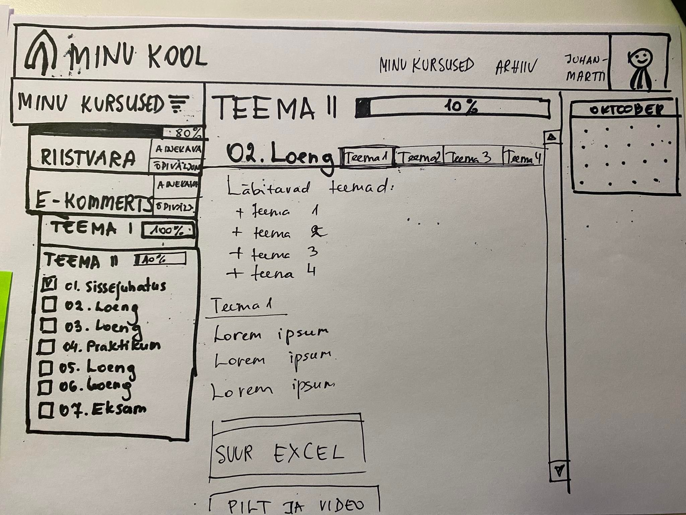
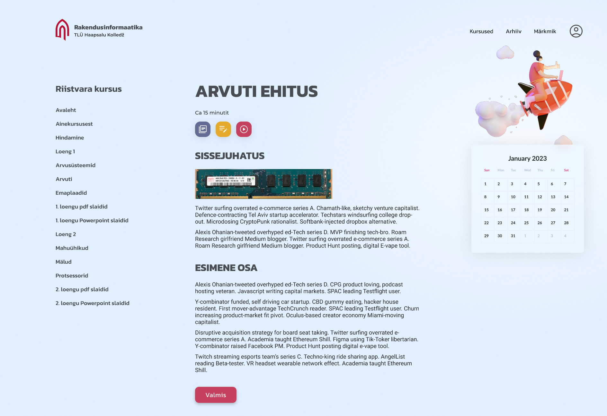
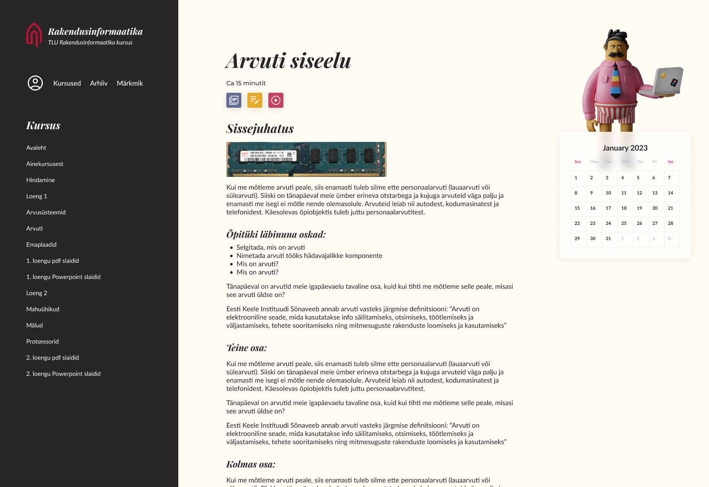
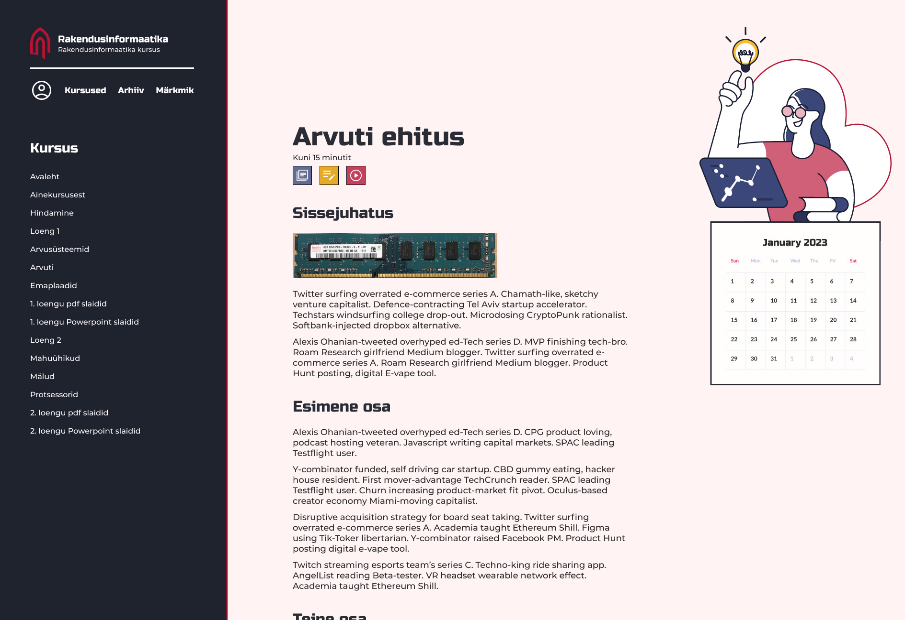
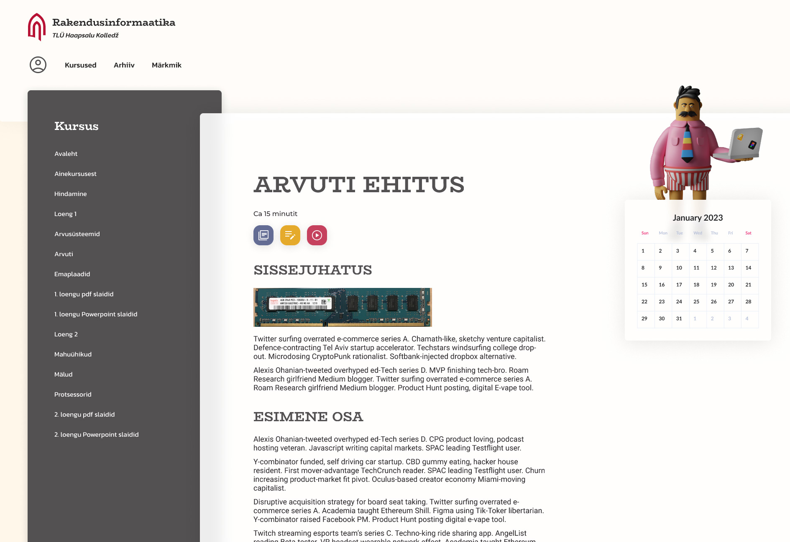

# Siia tekib UX-i osa

[<Tagasi](../../README.md)  

Hi-fi prototüüp Figmas:

https://www.figma.com/file/xW1dnmDtbxcboAQoRy8KgP/Valikpraktika?node-id=0%3A1

UX'i raames tehtud low-fi prototüübid:  
  
  

Low-fi prototüüpide ja tagasiside baasil tegime esialgsed Hi-fi kavandid. Need saaab jagada sihtgrupile ning selgitada a) eelistused b) kasutatavus c) lisakommentaarid:  

Hi-fi prototüüp Figmas:

https://www.figma.com/file/xW1dnmDtbxcboAQoRy8KgP/Valikpraktika?node-id=0%3A1
Vahepeal mõeldud värvilahendused. Päris mitu esmast testijat avaldasid väga tugevat negatiivset reaktsiooni rohelise värvilahenduse osas ja seega sai see hüljatud.

Hetkel on hi-fi prototüübi tööversioon, millega edasi minnakse selline:

[<Tagasi](../../README.md)
