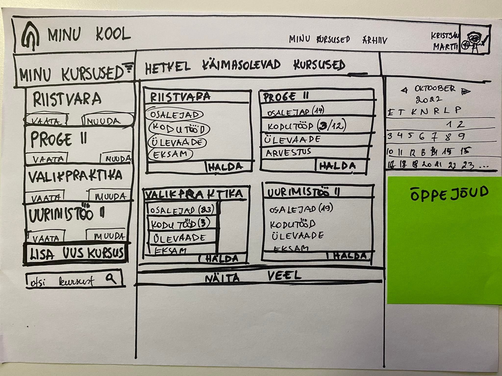

# Siia tekib UX-i osa

[<Tagasi](../../README.md)  
UX'i raames tehtud low-fi prototüübid:  
  
  

Low-fi prototüüpide ja tagasiside baasil tegime esialgsed Hi-fi kavandid. Need saaab jagada sihtgrupile ning selgitada a) eelistused b) kasutatavus c) lisakommentaarid:  

[<Tagasi](../../README.md)
